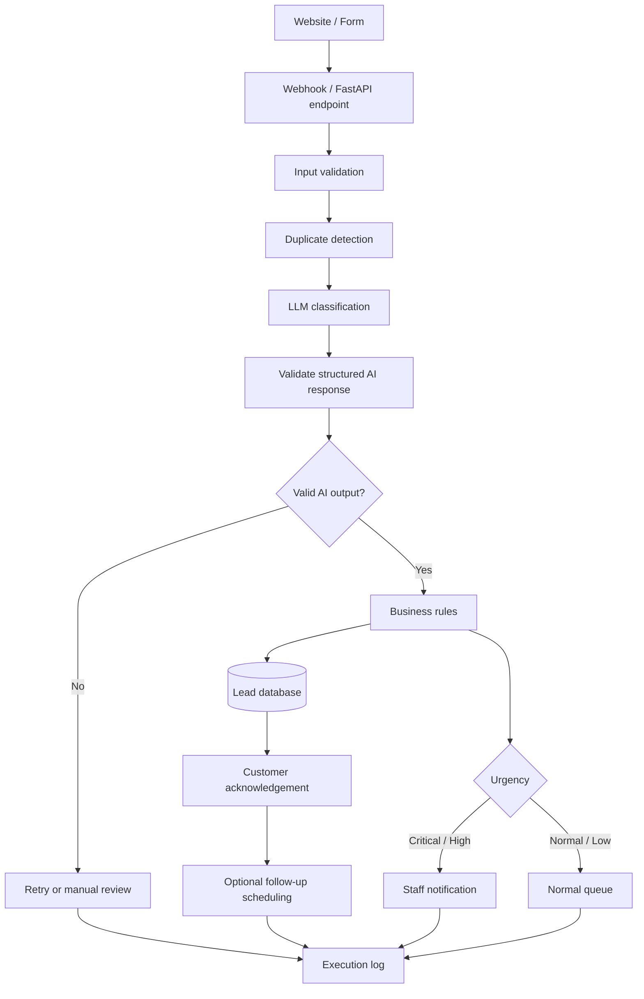

# AI Lead Intake & Follow-Up Automation

A portfolio project that demonstrates how a home-service company can automate website lead intake, validation, prioritization, persistence, acknowledgement, and follow-up.

## Business problem

A fictional home-service company receives customer inquiries through a website. Staff currently review each submission manually, decide whether it is urgent, classify the requested service, record the lead, and decide when to follow up.

The goal is to automate that repetitive workflow without hiding failures or trusting AI output blindly.

## Portfolio goal

Demonstrate a reliable, commercially useful automation using:

- n8n for workflow orchestration
- Python for custom processing
- FastAPI for API/webhook endpoints where useful
- an LLM API for structured lead classification
- SQLite first, with a database design that can move to PostgreSQL
- REST APIs, webhooks, JSON, Git/GitHub

## Milestone plan

1. Repository and architecture
2. Lead ingestion, validation, persistence, and duplicate detection
3. AI classification with strict structured output
4. n8n workflow orchestration
5. Follow-up automation
6. Portfolio polish and demo material

## Architecture



## Reliability rules

- Validate all inbound data before processing.
- Never trust raw LLM output directly.
- Validate AI output against a strict schema.
- Retry malformed AI output only when reasonable.
- Route unrecoverable AI failures to manual review.
- Never silently discard a lead.
- Prevent duplicate processing.
- Log workflow executions and failures.
- Keep secrets in environment variables.
- Use synthetic customer data only.

## Repository structure

```text
project-1-ai-lead-automation/
├── app/
│   ├── __init__.py
│   ├── config.py
│   └── db/
│       └── schema.sql
├── data/
│   └── sample_leads.json
├── docs/
│   └── architecture.md
├── scripts/
│   └── init_db.py
├── tests/
│   └── __init__.py
├── .env.example
├── .gitignore
├── LEARNING_NOTES.md
├── PORTFOLIO_NOTES.md
├── README.md
└── requirements.txt
```

## Local setup

```bash
python -m venv .venv
source .venv/bin/activate        # macOS/Linux
# .venv\\Scripts\\activate       # Windows PowerShell
pip install -r requirements.txt
cp .env.example .env
python scripts/init_db.py
```

The database initialization script creates a local SQLite database using `app/db/schema.sql`.

## Current status

Milestone 1 establishes the project structure and architecture. The API and business logic will be added incrementally in later milestones rather than pre-generating the entire application.
