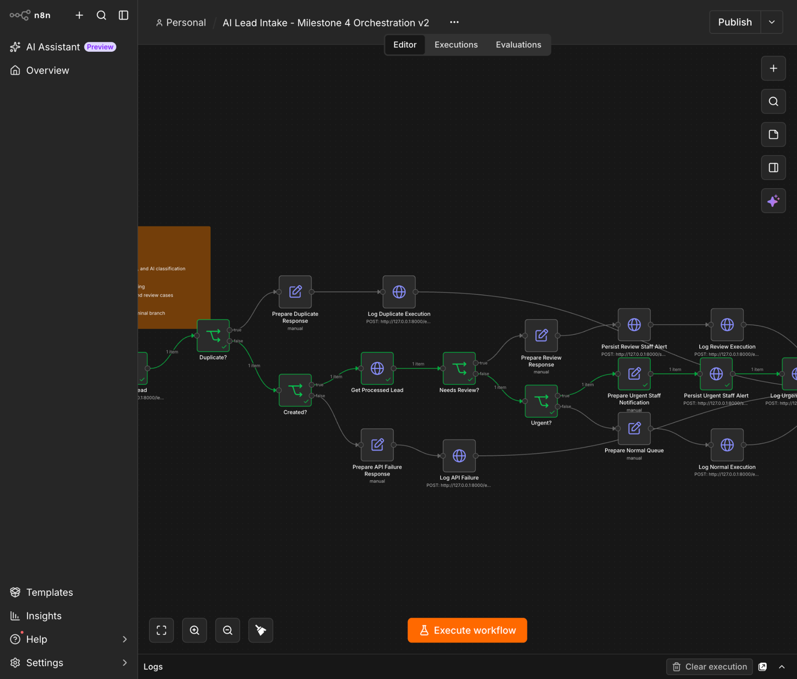
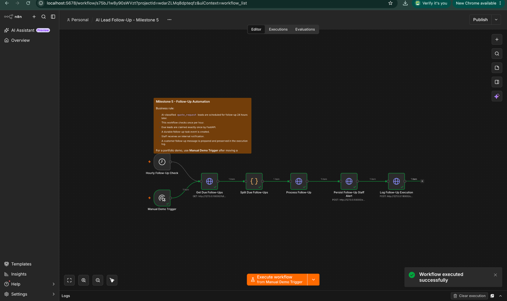
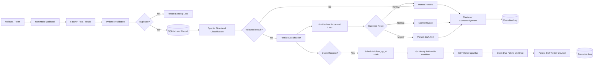

# AI Lead Intake & Follow-Up Automation

A production-style portfolio project that automates lead intake for a fictional home-service company using n8n, FastAPI, SQLite, and structured LLM output.

The system accepts website leads, validates and deduplicates them, classifies urgency and service type with AI, persists the result, routes urgent or failed cases, acknowledges the customer, schedules quote follow-ups, and records durable execution history.

## Why this project exists

A service business can lose time and revenue when every website inquiry must be manually reviewed before anyone knows whether it is urgent, a duplicate, a quote request, or something that needs human review.

This project demonstrates a practical automation pattern:

- deterministic validation and persistence in Python
- AI used only for bounded classification and summarization
- n8n used for visible orchestration and scheduling
- safe fallback when AI is unavailable
- duplicate protection and one-time follow-up processing
- durable workflow logs for traceability

## Demo highlights

All example customers are synthetic.

| Scenario | Expected behavior | Verified result |
| --- | --- | --- |
| Urgent electrical hazard | classify as emergency, notify staff, acknowledge customer | `emergency_repair` / `critical` |
| Duplicate submission | return the existing lead instead of processing it again | duplicate branch |
| Routine maintenance | route to normal queue | `maintenance` / `low` |
| Invalid email | reject at validation boundary and log failure | HTTP 422 branch |
| AI unavailable | preserve lead and route to manual review | `status=review` |
| Quote request after 24 hours | create one follow-up task and staff alert | follow-up processed once |

### Intake orchestration



### Follow-up orchestration



## Architecture



### Responsibility split

| Layer | Responsibility |
| --- | --- |
| FastAPI / Python | validation, normalization, persistence, deduplication, AI integration, follow-up business rules |
| OpenAI API | constrained lead classification and summary generation |
| n8n | webhook orchestration, branching, scheduled polling, notification workflow, customer-facing responses |
| SQLite | leads, deduplication state, follow-up schedule, execution history |

The split is intentional: logic that should be deterministic and unit-testable stays in Python, while cross-system orchestration remains visible in n8n.

## Reliability and failure handling

- Raw form input is validated before business logic runs.
- AI responses use a strict Pydantic schema rather than free-form text.
- A lead is persisted before AI classification so an AI outage cannot lose the request.
- AI failures route to `review` rather than silently dropping the lead.
- Duplicate detection uses a deterministic normalized fingerprint plus a database uniqueness constraint.
- Follow-ups are claimed atomically and `follow_up_at` is cleared after processing so the hourly workflow cannot repeatedly process the same task.
- Urgent alerts, review alerts, follow-up tasks, successes, duplicates, and failures are written to durable execution history.
- Secrets stay in environment variables and are excluded from exported workflows.
- All demo records use synthetic customer information.

## Tech stack

- Python 3.12
- FastAPI
- Pydantic
- SQLAlchemy
- SQLite
- OpenAI structured output
- n8n
- pytest
- REST / JSON / webhooks
- Git

## Repository structure

```text
ai-lead-automation/
├── app/
│   ├── ai/                     # prompt, provider, classification service
│   ├── api/                    # orchestration and follow-up endpoints
│   ├── db/                     # persistence repositories and schema
│   ├── main.py
│   └── schemas.py
├── data/
│   └── sample_leads.json
├── docs/
│   ├── architecture.md
│   ├── demo-script.md
│   └── screenshots/
├── n8n/
│   ├── ai-lead-intake-milestone4.json
│   └── ai-lead-follow-up-milestone5.json
├── scripts/
│   ├── init_db.py
│   └── live_ai_smoke.py
├── tests/
├── LEARNING_NOTES.md
├── PORTFOLIO_NOTES.md
└── README.md
```

## Local setup

Create the environment and database:

```bash
python3.12 -m venv .venv
source .venv/bin/activate
pip install -r requirements.txt
cp .env.example .env
python scripts/init_db.py
```

Add a valid OpenAI API key and configured model to `.env`, then start FastAPI:

```bash
uvicorn app.main:app --reload
```

In a second terminal, start n8n:

```bash
npx n8n
```

Import the two workflow exports from `n8n/`, then publish them in n8n.

The intake workflow exposes the local production webhook:

```text
POST http://localhost:5678/webhook/ai-lead-intake-v2
```

FastAPI documentation is available locally at:

```text
http://127.0.0.1:8000/docs
```

## Useful API endpoints

| Method | Endpoint | Purpose |
| --- | --- | --- |
| `GET` | `/health` | health check |
| `POST` | `/leads` | validate, deduplicate, persist, and classify a lead |
| `GET` | `/leads/{lead_id}` | retrieve processed lead state |
| `GET` | `/follow-ups/due` | return open quote requests whose follow-up time has arrived |
| `POST` | `/follow-ups/{lead_id}/process` | claim one due follow-up exactly once |
| `POST` | `/staff-notifications` | persist a staff alert from n8n |
| `GET` | `/staff-notifications` | inspect persisted staff alerts |
| `POST` | `/execution-logs` | persist a completed n8n execution event |
| `GET` | `/execution-logs` | inspect workflow history |

## Tests

Run:

```bash
pytest -q
```

Current verified result:

```text
43 passed
```

The suite covers schema validation, persistence, duplicate handling, AI response validation, AI failure fallback, orchestration endpoints, due-follow-up selection, and one-time follow-up processing.

## Sample end-to-end execution

A synthetic urgent lead submitted through the published n8n webhook produced:

```json
{
  "result": "urgent",
  "urgency": "critical",
  "classification": "emergency_repair",
  "action": "urgent_staff_notification",
  "customer_acknowledgement": "We received your urgent request. Our team will contact you as soon as possible."
}
```

A synthetic quote request was classified as `quote_request`, scheduled for follow-up 24 hours later, exposed through `/follow-ups/due`, processed by the Milestone 5 n8n workflow, and then removed from the due queue by clearing `follow_up_at`.

The resulting execution record preserved the staff alert, prepared customer follow-up text, task ID, due timestamp, and successful outcome.

## Business value

The automation targets repetitive work that is common in service businesses:

- immediate triage for urgent leads
- consistent lead classification
- fewer duplicate records
- less manual copying and status checking
- automatic quote follow-up
- traceable failure and review handling

### Illustrative time-savings model

This repository does not claim measured production ROI. A client can estimate potential savings using its real lead volume and handling time.

For example, if a business receives 40 leads per day, manual triage and recording takes 3 minutes per lead, and 80% can be handled without manual review:

```text
40 leads × 3 minutes × 80% = 96 minutes saved per day
96 minutes × 5 days = 8 hours saved per week
```

That estimate excludes additional time saved by duplicate prevention and automated follow-up. Actual savings depend on lead volume, review rate, integrations, and operating procedures.

## Limitations

This is a portfolio-grade local implementation, not a finished SaaS product.

- SQLite is appropriate for the demo but PostgreSQL would be preferable for multi-user production deployment.
- The API has no authentication, rate limiting, or webhook signature verification yet.
- Staff notifications are persisted internally rather than delivered to Slack, Teams, SMS, or email.
- Customer follow-up text is prepared and logged but not sent through a real messaging provider.
- n8n and FastAPI currently run locally rather than on managed infrastructure.
- There is no CI/CD pipeline, production monitoring, or centralized secret manager.
- LLM latency, cost, and provider availability remain external dependencies.

## Production-oriented next steps

- move persistence to PostgreSQL
- add API authentication and signed webhooks
- connect staff notifications to Slack, Teams, or email
- connect customer messages to email or SMS
- integrate a CRM instead of using SQLite as the operational system
- add containerized deployment and environment-specific configuration
- add CI, metrics, alerting, and log retention
- add privacy and retention rules for real customer data

## Demo

See [`docs/demo-script.md`](docs/demo-script.md) for a compact two-minute walkthrough designed for an Upwork client or interview.

## Project status

Milestones 1 through 5 are implemented and tested. Milestone 6 packages the working system as a client-facing portfolio case study with documentation, screenshots, demo material, business-value framing, limitations, and future improvements.
