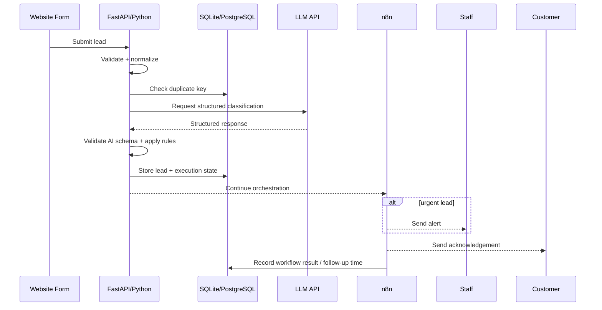

# Architecture Notes

## Design choice

The application will use a small Python API boundary plus n8n orchestration rather than splitting the project into multiple services.

Python is responsible for logic that benefits from deterministic code and testing, such as validation, duplicate-key generation, database access, AI-response validation, and business rules.

n8n is responsible for orchestration, branching, notifications, follow-up scheduling, and visibly demonstrating the automation workflow to a client.

## Data flow

## Why SQLite first

SQLite keeps local setup simple for a portfolio demo. The schema avoids SQLite-specific business logic so persistence can later move behind SQLAlchemy to PostgreSQL without redesigning the workflow.

## Important failure cases to design for

1. Missing or malformed form fields.
2. Repeated webhook delivery or customer double-submit.
3. LLM timeout, provider error, or malformed structured output.
4. Database write failure.
5. Notification failure after the lead has already been stored.
6. Follow-up scheduling failure.
7. A workflow retry accidentally repeating side effects.

The project will handle these incrementally in the milestone where each risk becomes relevant.
